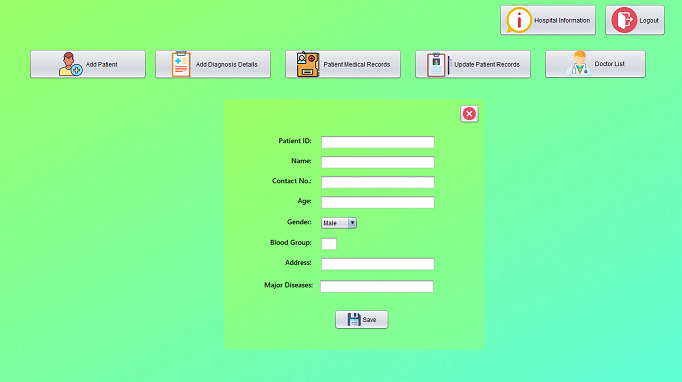
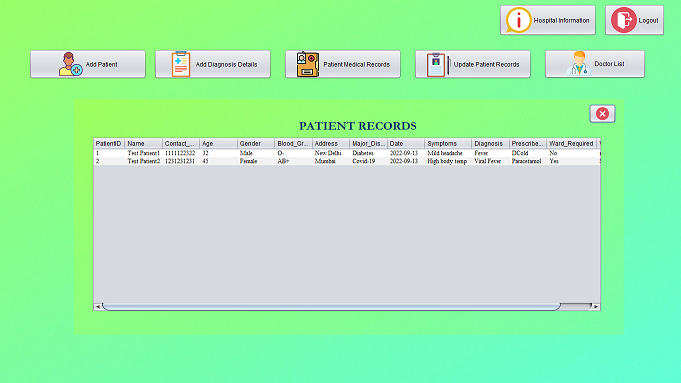

# HospitalManagementSystem
Hospital Management Application using Java Swing and MySQL

It is a window-based application made using Swing GUI package of Java that enables the user to maintain records of patients that visit a hospital for checkup and diagnosis and the available doctors.
It uses MySQL to maintain a database of the patients and doctors and their respective details.

## Screenshots

## Tech Stack

Java, Swing (Java), MySQL, Netbeans IDE
